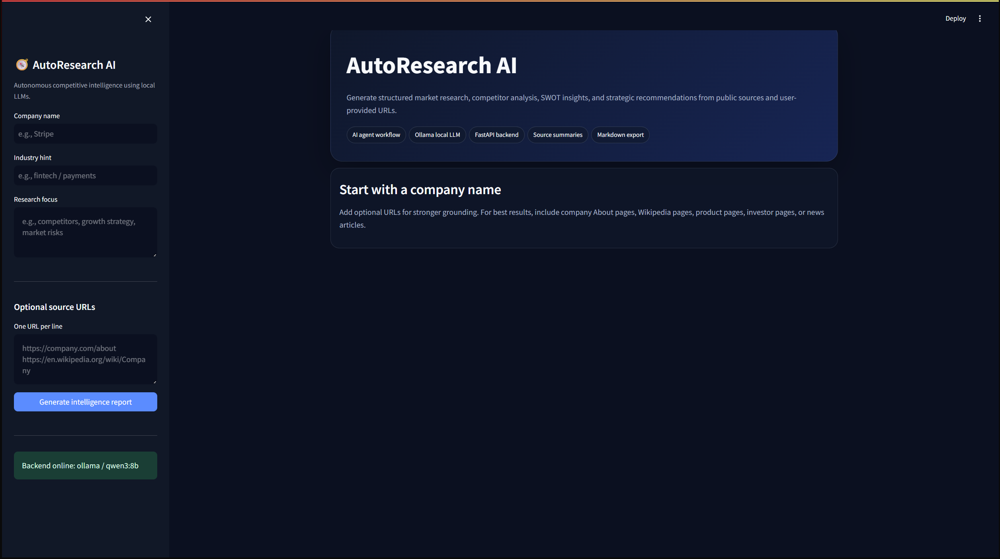
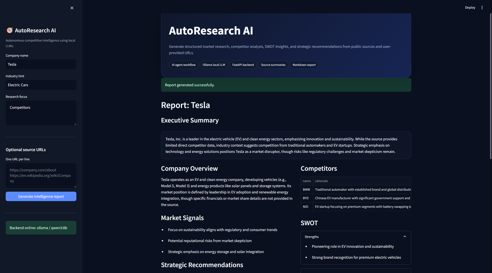

# AutoResearch AI — Autonomous Competitive Intelligence Agent

AutoResearch AI is a local-first AI research agent that generates structured competitive-intelligence reports from public web pages and user-provided URLs. It combines a FastAPI backend, Streamlit frontend, source collection, summarization, SWOT analysis, competitor profiling, and Ollama-powered local LLM inference.





## Features

- Company-level research workflow from a single input
- Optional user-provided URLs for stronger source grounding
- Public web-page extraction with Requests and BeautifulSoup
- Source-level summarization using a local LLM
- Competitor table, SWOT analysis, market signals, and recommendations
- Markdown report export
- FastAPI backend and Streamlit frontend
- Ollama/Qwen local inference with no paid API requirement

## Tech Stack

| Layer | Tools |
|---|---|
| Frontend | Streamlit |
| Backend | FastAPI, Pydantic |
| LLM | Ollama, Qwen3/Llama models |
| Collection | Requests, BeautifulSoup |
| Storage | Local JSON/Markdown reports |
| Language | Python |

## Architecture

```text
Company / URLs
     ↓
Source Collector
     ↓
Web Text Extraction
     ↓
Source Summarization
     ↓
Competitive Intelligence Agent
     ↓
Structured Report + SWOT + Competitor Table
     ↓
Markdown Export
```

## Setup Instructions

```bash
git clone https://github.com/YOUR_USERNAME/AutoResearch_AI.git
cd AutoResearch_AI
copy .env.example .env
pip install -r requirements.txt
ollama run qwen3:8b
```

Start backend:

```bash
python -m uvicorn backend.main:app --reload --port 8002
```

Start frontend:

```bash
python -m streamlit run frontend/app.py
```

Open:

```text
http://localhost:8501
```

## Example Input

```text
Company: Stripe
Industry hint: Fintech payments infrastructure
Research focus: Competitors, product positioning, growth strategy, and enterprise risks
Optional URLs:
https://stripe.com/about
https://en.wikipedia.org/wiki/Stripe,_Inc.
```


## Future Improvements

- Add Tavily/SerpAPI integration for higher-quality search
- Include citation scoring and source credibility ranking
- Add PDF and annual-report ingestion
- Support scheduled monitoring for competitor changes
- Add authentication and report history dashboard
- Deploy backend and frontend with Docker

## Disclaimer

AutoResearch AI is designed for educational and portfolio purposes. Web extraction depends on source accessibility and page structure. Generated reports should be reviewed before business use.
